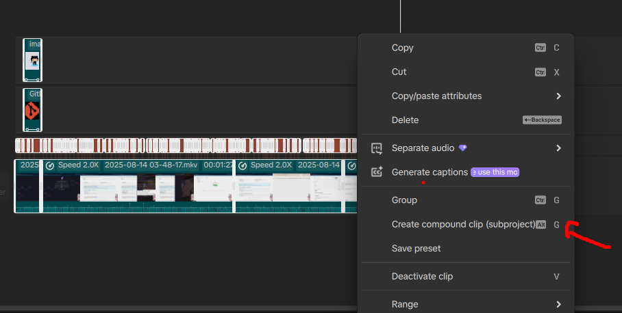
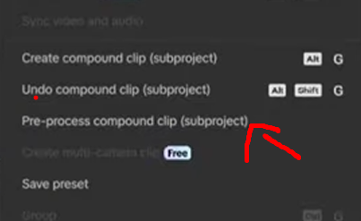
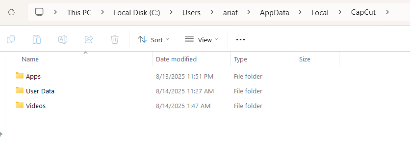
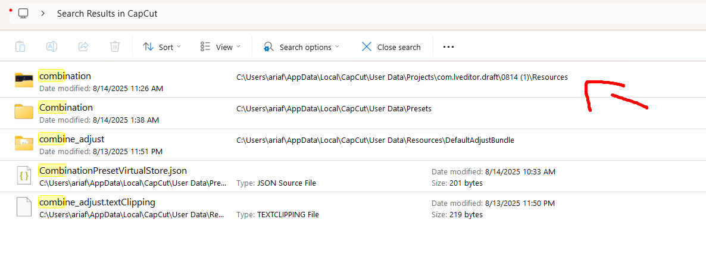

# cara export feature capcut pro
- [https://www.youtube.com/watch?v=sVd3Gx5uJxQ](https://www.youtube.com/watch?v=sVd3Gx5uJxQ)

## 1. lakukan ctrl + A, jika sudah lakukan click compount clip (subject project)

## 2. jika sudah nanti click proces componing clip

## 3. buka file explorer, lalu cari %appdata%
cari folder Local, dan buka capcut **C:\Users\ariaf\AppData\Local\CapCut**

lalu cari **combination**

setelah itu buka dan copy file nya ke dalam folder kalian dan sekarang kita sudah berhasil melakukan export video dengan free
