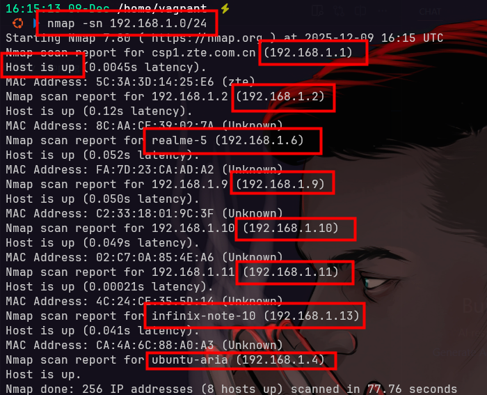
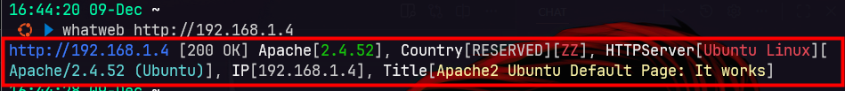

# Network Enumeration Essentials
## Flow
Host Discovery → Port Scanning → Service Enumeration → Vulnerability Mapping





## Host Discovery
```bash
ping -c 1 <ip>
arp-scan -l
netdiscover -r 192.168.1.0/24
nmap -sn 192.168.1.0/24
```

## Port Scanning
### Quick Scan
```bash
nmap -sC <ip> # Default scripts
nmap -sV <ip> # Detect services and versions
nmap -A <ip> # Aggressive scan with OS detection and scripts
```

### Fast Scan
```bash
nmap -F <ip> # Scan top 100 ports
nmap -T4 -F <ip> # Fast scan of common ports
```

### Full Scan
```bash
nmap -p- <ip> # Scan all 65535 ports
```

## Service Enumeration
### web
```bash
whatweb <ip>
nikto -h <ip>
nmap --script http-enum <ip>
```

### SMB
```bash
smbclient -L //<ip>/
enum4linux <ip>
nmap --script smb-os-discovery <ip>
```

### FTP
```bash
nmap -sV -p 21,22 <ip>
```
