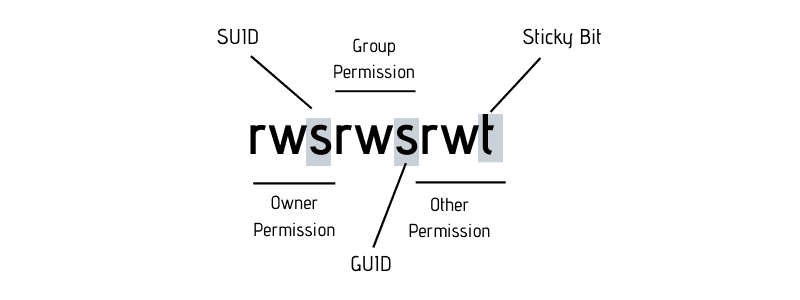
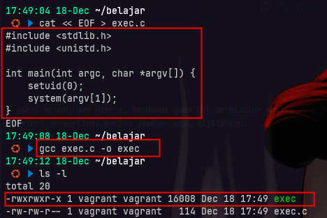
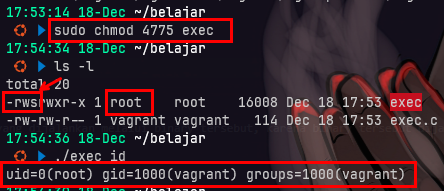
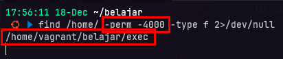
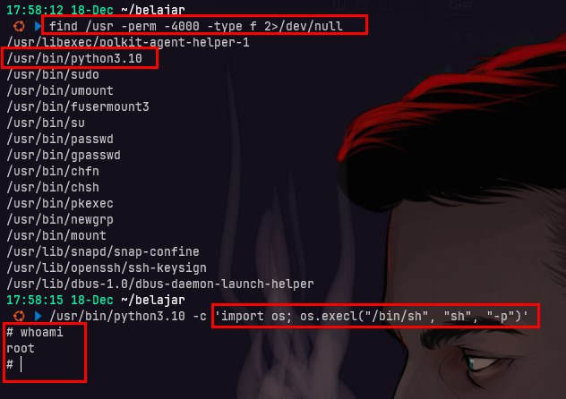

# privilege escalation via SUID binaries
## Apa itu SUID
- SUID (Set User ID) = binary dijalankan dengan hak akses owner
- Jika owner = root → potensi privilege escalation

## apa itu bit permission khusus
- Pada sistem operasi Unix/Linux, selain permission standar (read, write, execute) untuk user, group, dan others, terdapat juga bit permission khusus yang dapat diatur pada file atau direktori. Bit permission khusus ini meliputi SUID (Set User ID), SGID (Set Group ID), dan Sticky bit.
- Bit permission khusus ini memiliki fungsi tertentu yang mempengaruhi cara file atau direktori berperilaku ketika diakses atau dijalankan.



Bit permission khusus:
- SUID = 4
  - merupakan bit permission khusus pada file executable di sistem operasi Unix/Linux.
  - Ketika sebuah file executable memiliki bit SUID diatur, itu berarti bahwa ketika file tersebut dijalankan, proses yang dihasilkan akan berjalan dengan hak akses dari pemilik file tersebut, bukan dengan hak akses dari pengguna yang menjalankannya.
  - Contohnya, jika sebuah file executable dimiliki oleh pengguna root dan memiliki bit SUID diatur, maka ketika pengguna biasa menjalankan file tersebut, proses yang dihasilkan akan memiliki hak akses root.
SGID = 2
  - mirip dengan SUID, tetapi berlaku untuk grup.
Sticky = 1
  - biasanya digunakan pada direktori untuk mencegah pengguna menghapus atau memindahkan file yang dimiliki oleh pengguna lain di dalam direktori tersebut.
  - Misalnya, direktori /tmp sering kali memiliki bit sticky diatur untuk mencegah pengguna menghapus file milik pengguna lain.

## membuat SUID binary sederhana
1. buat file exec.c
2. compile dengan gcc


3. ubah owner ke root


kita membuat sebuah program sederhana dalam bahasa C yang menerima argumen perintah dari command line dan menjalankannya dengan hak akses root menggunakan fungsi setuid(0) untuk mengubah user ID proses menjadi root sebelum mengeksekusi perintah tersebut.

4. atur permission SUID dengan chmod
5. jalankan binary dengan argumen perintah yang diinginkan

setelah mengatur permission SUID pada binary exec, bisa dilihat ketika kita menjalankan binary exec dengan argumen perintah "id" hasilnya menunjukkan bahwa perintah tersebut dijalankan dengan hak akses root.



hasilnya user yang menjalankan binary akan mendapatkan hak akses root untuk perintah yang dijalankan melalui binary tersebut, karena binary tersebut dijalankan dengan hak akses pemiliknya (root).
```bash
cat << EOF > exec.c
#include <stdlib.h>
#include <unistd.h>

int main(int argc, char *argv[]) {
    setuid(0);
    system(argv[1]);
}
EOF

gcc exec.c -o exec

sudo chown root:root exec # ubah owner ke root

sudo chmod 4775 exec # set SUID bit (SUID = 4, SGID = 2, Sticky = 1)
sudo chmod u+s exec # set SUID bit
sudo chmod g+s exec # set SGID bit

mkdir -p /home/public
sudo chmod o+t /home/public  # set Sticky bit

./exec "/bin/sh"
./exec "id"
```

## mencari SUID binaries di sistem
1. mencari SUID binaries dengan perintah find
kita dapat mencari SUID binaries di sistem Linux dengan menggunakan perintah find. Perintah ini akan mencari file yang memiliki permission SUID (Set User ID) di seluruh sistem.
find / -perm -4000 -type f 2>/dev/null # mencari SUID binaries

2. menjalankan payload pada SUID binary yang rentan
misal kita menemukan SUID binary yaitu /usr/bin/python, kita bisa menjalankan payload untuk mendapatkan shell root.
di python kita bisa menggunakan modul os untuk menjalankan perintah sistem, kita bisa menggunakan os.execl("/bin/sh") untuk mendapatkan shell.

/usr/bin/python3 -c 'import os; os.execl("/bin/sh", "sh", "-p")'

```bash
find / -perm -4000 -type f 2>/dev/null

sudo chmod u+s /usr/bin/testbin

ls -l /usr/bin/testbin
# -rwsr-xr-x 1 root root testbin
```





---

Privilege escalation tidak selalu membutuhkan exploit kernel.
Dalam banyak kasus, misconfigured SUID binaries sudah cukup untuk mendapatkan akses root.

SUID (Set User ID) memungkinkan sebuah binary dijalankan dengan hak akses pemiliknya. Jika binary tersebut dimiliki oleh root dan memiliki perilaku berbahaya, maka privilege escalation menjadi mungkin.

Pada tahap ini, Red Teamer memanfaatkan hasil enumerasi dari shell terbatas untuk mengidentifikasi SUID binaries yang dapat disalahgunakan dan mengubah akses user biasa menjadi root.

CPES (Certified Privilege Escalation Specialist) menguji kemampuan ini secara nyata, menuntut peserta memahami bagaimana membaca konfigurasi sistem dan memanfaatkan SUID sebagai jalur eskalasi pada lingkungan Linux enterprise.

🔗 Linuxenic Corp
https://linuxenic.com

🎓 Daftar CPES
https://linuxenic.com/cpes

@linuxenicorp @linuxenic

#CPES #Linuxenic #PrivilegeEscalation #SUID #LinuxSecurity #RedTeam #OffensiveSecurity #EthicalHacking #CyberSecurity
