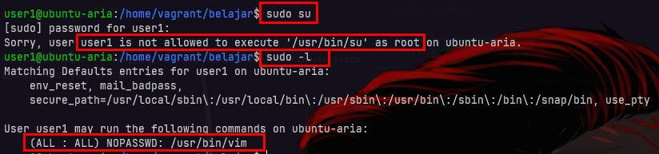
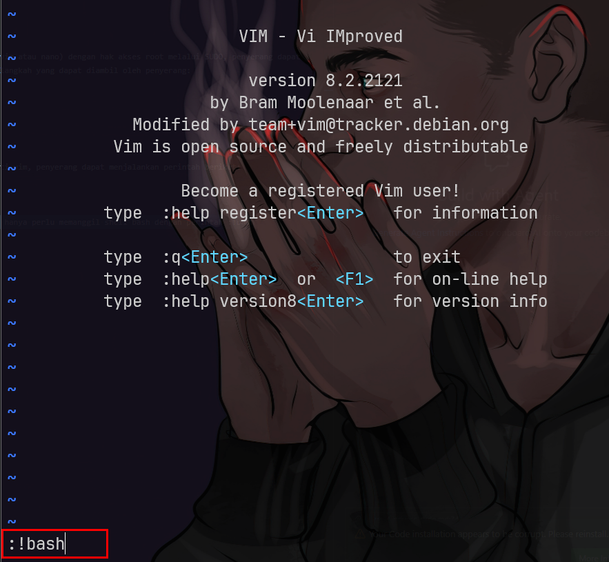
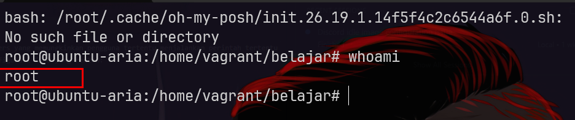

# Privilege Escalation via SUDO
## Apa itu Privilege Escalation via SUDO?
Privilege Escalation via SUDO adalah teknik yang digunakan oleh penyerang untuk mendapatkan hak akses administratif (root) pada sistem Linux dengan memanfaatkan konfigurasi SUDO yang salah atau celah keamanan.

## Bagaimana Cara Kerjanya?
- Privilege Escalation via SUDO bekerja dengan cara mengeksploitasi konfigurasi SUDO yang memungkinkan pengguna tertentu menjalankan perintah tertentu dengan hak akses root.
- Jika konfigurasi ini tidak diatur dengan benar, penyerang dapat menjalankan perintah yang seharusnya tidak diizinkan, sehingga mendapatkan akses root.

## membuat SUDO yang Rentan
Untuk membuat konfigurasi SUDO yang rentan, kita dapat menambahkan entri di file sudoers yang memungkinkan pengguna tertentu menjalankan perintah tertentu dengan hak akses root tanpa batasan. Berikut adalah langkah-langkah untuk membuat konfigurasi SUDO yang rentan:

1. Buka file sudoers menggunakan visudo:
   ```bash
   sudo visudo
   ```
2. Tambahkan entri berikut di akhir file sudoers untuk memberikan izin kepada pengguna tertentu (misalnya, user1) untuk menjalankan perintah tertentu (misalnya, /usr/bin/vim) dengan hak akses root tanpa batasan:
   ```bash
   user1 ALL=(ALL) NOPASSWD: /usr/bin/vim
   ```
3. Simpan dan keluar dari editor.

## Eksploitasi SUDO yang Rentan
Misalnya, jika seorang pengguna memiliki izin untuk menjalankan editor teks (seperti vim atau nano) dengan hak akses root melalui SUDO, penyerang dapat memanfaatkan editor tersebut untuk membuka shell root. Berikut adalah contoh langkah-langkah yang dapat diambil oleh penyerang:
1. Menemukan pengguna yang memiliki izin SUDO untuk menjalankan editor teks:
   ```bash
   sudo -l
   ```
   
2. Menjalankan editor teks dengan hak akses root:
   setelah mengetahui bahwa user1 dapat menjalankan vim dengan SUDO yang rentan seperti vim, penyerang dapat menjalankan perintah berikut:
   ```bash
    sudo vim
    ```
    
    setelah menjalankan :!bash di vim dapat menjalankan perintah dengan :!, jadi kita hanya perlu memanggil shell bash dengan perintah :!bash
3. Dalam editor teks, membuka shell dengan perintah:
    ```vim
    :!bash
    ```
    
4. Sekarang penyerang memiliki akses shell dengan hak akses root.
   
