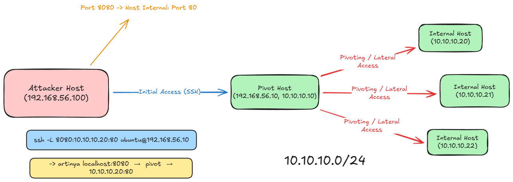
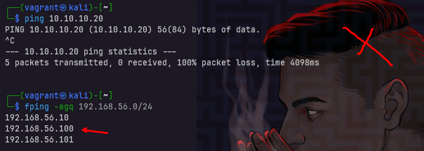
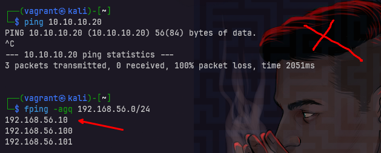
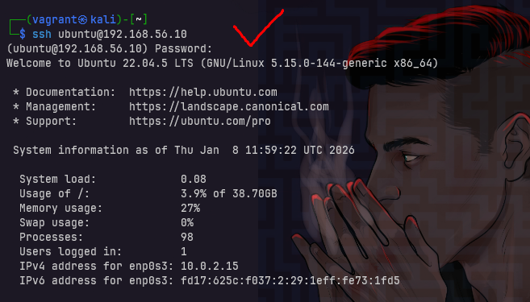

Siap. Gue bikinin **TEKS POSTER LENGKAP + BENER SECARA TEKNIS**, flow rapi, istilah aman, **nggak ada info ngawur**, dan **ada tampilan praktik dikit** tapi tetap poster-friendly.
Ini bisa langsung lo copas buat desain.

---

# **REMOTE ACCESS & PIVOTING ESSENTIALS**

**SSH • Foothold • Lateral Movement**

---

## Apa itu Remote Access?

**Remote Access** adalah kemampuan untuk **mengakses dan mengendalikan sistem dari jarak jauh** melalui jaringan.

Dalam dunia Linux & security, metode paling umum adalah:

> **SSH (Secure Shell)**

SSH memungkinkan kita:

* Login ke sistem lain
* Menjalankan perintah dari jarak jauh
* Mengelola server dengan koneksi terenkripsi

📌 **SSH = Remote terminal yang aman**

---

## 1️⃣ SSH REMOTE ACCESS

**“Masuk ke sistem dari jarak jauh secara aman”**

SSH berjalan di:

* **Port default:** `22/tcp`
* **Protokol:** Encrypted (aman dari sniffing)

---

### 🔹 Cara Login SSH (Basic)

```bash
ssh user@ip_address
```

Contoh:

```bash
ssh ubuntu@192.168.1.10
```

---

### 🔹 SSH dengan Opsi `-l`

Nama resminya: **SSH login name option**

```bash
ssh -l username ip_address
```

Contoh:

```bash
ssh -l root 192.168.1.10
```

📌 Fungsi **SAMA**, cuma beda gaya penulisan.

---

### 🔹 SSH dengan Port Custom

Kalau SSH tidak pakai port 22:

```bash
ssh -p 2222 user@ip_address
```

---

### 🔹 SSH dengan Key (Umum di server)

```bash
ssh -i id_rsa user@ip_address
```

📌 Lebih aman dibanding password.

---

### 🔹 Praktik (Contoh Tampilan)

```
$ ssh ubuntu@192.168.1.10
Welcome to Ubuntu 22.04 LTS
ubuntu@server:~$
```

➡️ Artinya: **Remote access berhasil**

---

## 2️⃣ FOOTHOLD

**“Sudah punya pijakan di dalam sistem”**

**Foothold** adalah kondisi saat attacker:

* Sudah **berhasil masuk**
* Bisa **menjalankan command**
* Belum tentu punya akses penuh (root)

📌 **SSH access = foothold yang valid**

---

### Kenapa Foothold Penting?

Karena:

* Bukan lagi serangan dari luar
* Sudah berada **di dalam jaringan**
* Bisa lanjut ke tahap berikutnya

Analogi:

> “Sudah masuk rumah, meskipun masih di ruang tamu.”

---

## 3️⃣ PIVOTING

**“Menggunakan satu sistem untuk menyerang jaringan lain”**

**Pivoting** adalah teknik:

> **Memanfaatkan mesin yang sudah kita kuasai sebagai jembatan ke jaringan internal lain**

Biasanya dipakai karena:

* Target lain **tidak bisa diakses langsung**
* Firewall hanya mengizinkan koneksi internal

---

### Contoh Kasus Pivoting

* Kita SSH ke **Server A**
* Server A terhubung ke **Network Internal**
* Dari luar → ❌ tidak bisa akses
* Dari Server A → ✅ bisa akses

📌 Server A = **Pivot Host**

---

## Jenis Pivoting dengan SSH

### 🔹 Dynamic Port Forwarding (SOCKS Proxy)

```bash
ssh -D 9050 user@pivot_host
```

Fungsi:

* Membuat proxy SOCKS
* Tools lain bisa lewat jaringan internal

Biasanya dipakai bareng:

* `proxychains`
* browser
* nmap internal scan

---

### 🔹 Local Port Forwarding

```bash
ssh -L 8080:internal_ip:80 user@pivot_host
```

Artinya:

* Akses `localhost:8080`
* Dialihkan ke `internal_ip:80`

📌 Cocok buat akses web internal.

---

### 🔹 Praktik (Ilustrasi)

```
Attacker → SSH → Server A → Internal Network
```

➡️ **Traffic “menyamar” sebagai traffic internal**

---

## Istilah Penting yang Sering Muncul

* **Pivot Host**
* **Jump Host**
* **Bastion Host**
* **Lateral Movement**

📌 **Pivoting = bagian dari Lateral Movement**

---

## Flow Serangan (Big Picture)

1. **Enumeration**
   Cari host & service

2. **SSH Access**
   Remote login berhasil

3. **Foothold**
   Sudah ada pijakan

4. **Pivoting**
   Masuk ke jaringan internal

5. **Further Attack**
   Privilege escalation, data access, dll

---

## Ringkasan Cepat

* **SSH** → Remote access
* **Foothold** → Sudah di dalam
* **Pivoting** → Loncat jaringan
* **Satu akses bisa membuka seluruh network**

---

## Tagline Poster (Siap Pakai)

> **Enumeration menemukan pintu.
> SSH memberi akses.
> Pivoting membuka jaringan internal.**

Atau versi singkat:

> **Masuk satu sistem, jelajah seluruh jaringan.**

---

Kalau mau, next step gue bisa:

* Rapihin jadi **versi super ringkas (A4 poster)**
* Tambahin **diagram ASCII / visual flow**
* Bikin **seri lanjutan: Privilege Escalation Essentials**

Tinggal bilang mau **pemula / intermediate / CTF-style** 🔥


------

# REMOTE ACCESS & PIVOTING ESSENTIALS
Apa itu Remote Access?
- Kemampuan mengakses & mengendalikan sistem dari jarak jauh.
- Metode umum: SSH (Secure Shell) untuk login & menjalankan perintah.

Apa itu SSH?
Protokol aman untuk remote terminal dengan enkripsi data.

Apa itu Foothold?
- Kondisi saat attacker sudah berhasil masuk & menjalankan command.
- SSH access = foothold yang valid.

Apa itu Pivoting?
- Teknik menggunakan sistem yang sudah dikuasai sebagai jembatan ke jaringan internal lain.
- Digunakan saat target tidak bisa diakses langsung.

Jenis Pivoting dengan SSH:
- Local Port Forwarding
  - Mengalihkan port di mesin attacker (lokal) ke port pada host internal melalui pivot host.
  - Fungsi: Mengakses service internal yang tidak bisa diakses langsung.
  - Command: `ssh -L 8080:internal_ip:80 user@host`
- Remote Port Forwarding
  - Mengalihkan port di pivot/remote host ke port di mesin attacker atau internal host.
  - Fungsi: Membuka akses ke service di balik NAT / firewall dari sisi luar.
  - Command: `ssh -R 9090:internal_ip:80 user@host`
- Dynamic Port Forwarding (SOCKS Proxy)
  - Membuat SOCKS proxy di mesin attacker untuk routing trafik dinamis ke jaringan internal.
  - Fungsi: Scanning, web access, dan lateral movement tanpa port spesifik.
  - Command: `ssh -D 9050 user@host`
    - Gunakan dengan proxychains seperti `proxychains curl http://internal_ip` atau `torsocks -P 9050 curl http://internal_ip`
      ```bash
      torsocks -P 1080 curl http://10.10.10.20
      ```

## topology


## Enumeration Host Active
misalnya kita memiliki sebuah host pivot dengan ip 192.168.10.10 dan sebuah host internal dengan ip 10.10.10.20 kita ingin melakukan akses ke host internal tersebut namun kita tidak bisa langsung mengaksesnya dari luar jaringan.

<!--  -->


```bash
ping 10.10.10.20 # tidak bisa akses
fping -agq 192.168.56.0/24
```

## Melakukan test ssh ke pivot host
jika kita sudah mendapatkan akses ke host pivot misalnya, dan telah mendapatkan ssh access ke host pivot tersebut kita bisa melakukan pivoting ke host internal yang ada di jaringan tersebut.
```bash
ssh ubuntu@192.168.56.10
```



## Melakukan Local Port Forwarding
Setelah mengetest keberhasilan ssh ke pivot host, kita bisa melakukan local port forwarding ke host internal yang ingin kita akses.

```bash
ssh -N -L 8080:10.10.10.20:80 ubuntu@192.168.56.10
```

> artinya localhost:8080  →  pivot  →  10.10.10.20:80

## cara Dynamic Port Forwarding (SOCKS Proxy)
```bash
ssh -N -D 9050 ubuntu@192.168.56.10
```

> terbentuk SockProxy (127.0.0.1:9050)

setelah itu gunakan proxychains atau browser dengan setting SOCKS5 ke

```bash
torsocks -P 9050 curl http://10.10.10.20
```
atau gunakan proxychains
```bash
proxychains curl http://10.10.10.20
```

---

🔐 REMOTE ACCESS & SSH PIVOTING ESSENTIALS

Ketika target internal nggak bisa diakses langsung dari luar jaringan, di situlah pivoting berperan.

Pivoting adalah teknik menggunakan host yang sudah kita kuasai (foothold) sebagai jembatan untuk menjangkau jaringan internal lain.
Teknik ini umum dilakukan menggunakan SSH tunneling.

Dengan SSH Pivoting, kita bisa:
• Mengakses service internal tersembunyi
• Melewati segmentasi jaringan
• Melakukan enumeration internal
• Lateral movement tanpa expose port

Jenis pivoting yang sering digunakan:
• Local Port Forwarding
• Dynamic Port Forwarding (SOCKS Proxy)
• Remote Port Forwarding

Pivoting bukan soal tools, tapi cara memahami alur jaringan dari sudut pandang attacker 🧠

🎓 CPES – Certified Privilege Escalation Specialist
Belajar teknik foothold, pivoting, hingga privilege escalation dengan pendekatan real-world attack scenario.

🔗 https://linuxenic.com/cpes

🌐 Linuxenic Corp
https://linuxenic.com

@linuxenicorp @linuxenic

#CPES #Linuxenic
#SSHPivoting #RemoteAccess
#CyberSecurity #EthicalHacking
#LinuxSecurity #RedTeam #LateralMovement
