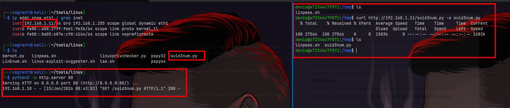
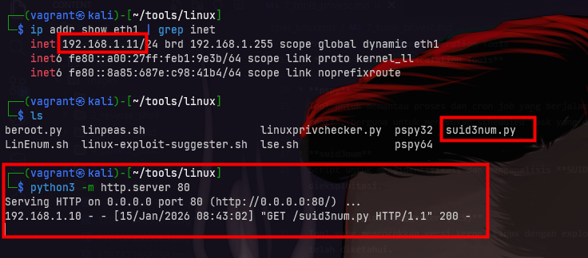
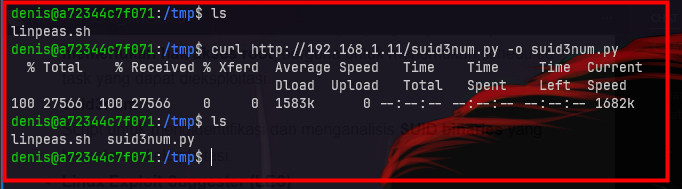
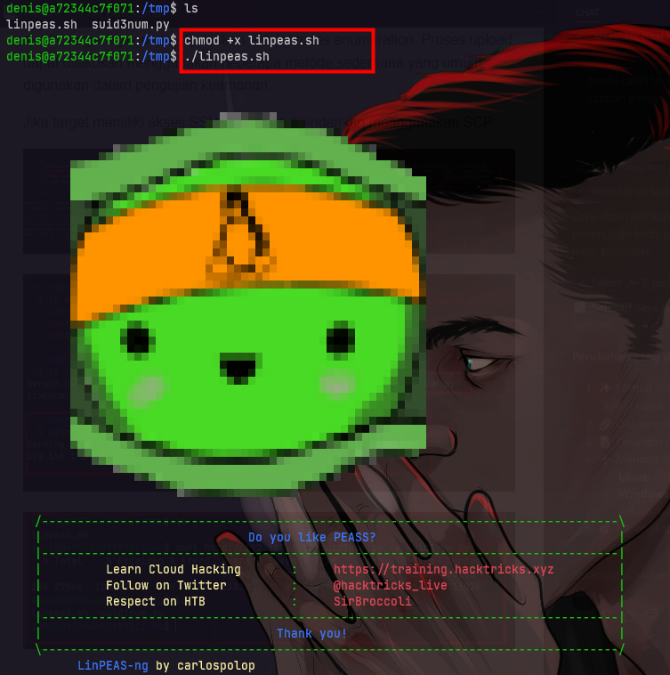
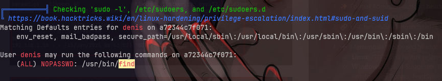
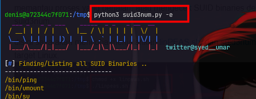
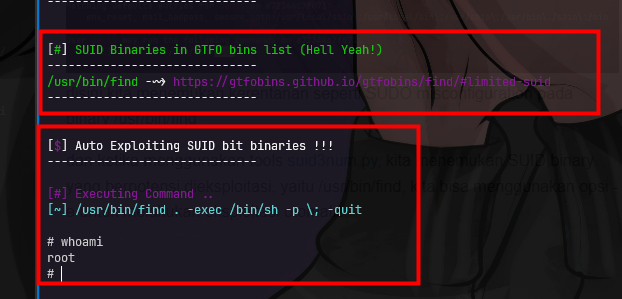

# Privilege Escalation Enumeration Tools
Privilege Escalation Enumeration adalah proses mengidentifikasi konfigurasi lemah dan celah keamanan pada sistem yang dapat dimanfaatkan untuk meningkatkan hak akses dari user biasa menjadi administrator (root/Administrator).

Proses ini biasanya dilakukan setelah attacker mendapatkan foothold, sebelum melakukan eksploitasi lanjutan.

## Kenapa Menggunakan Tools Otomatis?
- Menghemat waktu enumerasi manual
- Mengurangi human error
- Menampilkan temuan penting secara terstruktur
- Digunakan secara luas dalam praktik penetration testing nyata

> ⚠️ Tools ini tidak langsung mengeksploitasi, tetapi membantu menemukan potensi privilege escalation.

Siap, ini aku **TAMBAHIN tapi tetap RAPI, SEJENIS, dan POSTER-FRIENDLY**.
Nggak nambah yang aneh-aneh, cuma **yang umum & relevan**.

---

## **Linux Privilege Escalation Tools**

* **linPEAS · LinEnum**
  Script bash untuk melakukan enumerasi otomatis pada sistem Linux guna menemukan konfigurasi lemah, file sensitif, dan potensi privilege escalation.

* **pspy**
  Tool untuk memantau proses dan cron job yang berjalan **tanpa memerlukan hak akses root**, berguna untuk menemukan scheduled task yang dapat dieksploitasi.

* **suid3num**
  Script untuk mengidentifikasi dan menganalisis **SUID binaries** yang berpotensi dieksploitasi.

* **Linux Exploit Suggester (LES)**
  Tool yang mencocokkan versi kernel Linux dengan exploit privilege escalation yang telah diketahui.

* **GTFOBins**
  Database referensi binary Linux yang dapat disalahgunakan untuk privilege escalation melalui **SUDO, SUID, atau capability abuse**.

---

## **Windows Privilege Escalation Tools**

* **winPEAS · Windows Exploit Suggester**
  Script enumerasi Windows untuk mencari konfigurasi lemah, file sensitif, informasi sistem, dan potensi privilege escalation berdasarkan patch dan build OS.

* **PowerUp**
  Modul PowerShell untuk enumerasi privilege escalation berbasis misconfiguration, seperti service abuse, unquoted service path, dan weak permission.

* **Rotten Potato · Juicy Potato · RoguePotato · SweetPotato**
  Eksploit privilege escalation yang memanfaatkan **token impersonation** pada Windows, biasanya melalui **DCOM, NTLM, atau COM service**, untuk menaikkan hak akses dari service account menjadi **SYSTEM**.

* **PrintSpoofer**
  Eksploit privilege escalation yang menyalahgunakan **Print Spooler service** untuk melakukan token impersonation dan memperoleh hak akses **SYSTEM** tanpa konfigurasi COM yang kompleks.

## praktek
Setelah foothold diperoleh, tools privilege escalation perlu dipindahkan ke sistem target agar dapat dijalankan untuk proses enumeration. Proses upload dapat dilakukan menggunakan beberapa metode sederhana yang umum digunakan dalam pengujian keamanan.

Jika target memiliki akses SSH, file dapat dipindahkan menggunakan SCP:

Setelah tools berhasil di-upload ke sistem target, tahap selanjutnya adalah melakukan enumeration privilege escalation untuk mengidentifikasi potensi celah yang dapat dimanfaatkan.

Pada sistem Linux, proses enumeration dapat dilakukan menggunakan tools seperti linPEAS dan LinEnum, kita juga bisa menggunakan pspy untuk memantau proses yang berjalan, atau mengecek SUID binaries dengan suid3num.

disini saya akan mencoba menjalankan linPEAS.sh, dan suid3num.py pada target Linux.

disini kita menemukan kerentanan seperti SUDO misconfiguration pada binary /usr/bin/find

dan ketika menggunakan tools suid3num.py, kita menemukan SUID binary yang berpotensi dieksploitasi, yaitu /usr/bin/find, kita bisa menggunakan opsi -e untuk melakukan eksploitasi otomatis.

---
