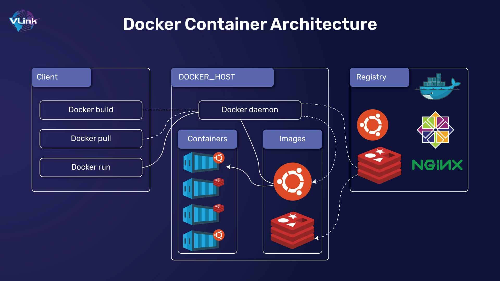

# 🐳 Docker
## Apa itu Docker?

Docker adalah **platform open-source** yang digunakan untuk membuat, mengemas, dan menjalankan aplikasi di dalam **container**. Dengan Docker, aplikasi bisa berjalan **konsisten** di berbagai lingkungan (laptop, server, cloud) tanpa masalah konfigurasi.

---

## 2️⃣ Konsep Dasar Docker



### 🔹 **Image**

* Blueprint / template dari container.
* Berisi aplikasi + dependency + environment.
* Contoh: `nginx:latest`, `python:3.10`.

### 🔹 **Container**

* Unit yang berjalan dari image.
* Bisa dianggap **instansiasi image**.
* Container = proses yang terisolasi dengan semua kebutuhan aplikasi.
* Contoh: kalau `image` = resep, maka `container` = masakan yang jadi.

### 🔹 **Registry**

* Tempat penyimpanan dan distribusi image.
* Public: **Docker Hub** (default).
* Private: GitHub Container Registry, AWS ECR, GitLab Registry, dsb.

### 🔹 **Docker Daemon & CLI**

* **Docker Daemon** (`dockerd`) → service yang menjalankan container.
* **Docker CLI** (`docker`) → command-line tool untuk berinteraksi dengan daemon.

## `docker run`

```bash
docker run <namespace>/<image>:<tag>
```

Secara internal, `docker run` melakukan:

1. `docker pull <namespace>/<image>:<tag>` → menarik image kalau belum ada.
2. `docker create <namespace>/<image>:<tag>` → membuat container dari image.
3. `docker start <container>` → menjalankan container tersebut.

---

## 🔧 Opsi Penting di `docker run`

### 1. `--name`

Memberi nama khusus pada container.

```bash
docker run --name myapp nginx
```

### 2. `-v` → **Volume mounting**

Sinkronisasi folder lokal dengan container.

```bash
-v <path_host>:<path_container>
-v ./src:/app
```

### 3. `-p` → **Port mapping**

Menghubungkan port host ↔ port container.

```bash
-p <port_host>:<port_container>
-p 80:80       # host:80 -> container:80
-p 8080:80     # host:8080 -> container:80
```

### 4. `--net`

Mengatur network mode container.

* default: `bridge`
* opsi lain: `host`, `none`, `container:<name_or_id>`

### 5. `-it`

Interactive + TTY → biasanya untuk akses shell.

```bash
docker run -it ubuntu bash
```

### 6. `-d`

Detached mode → jalan di background (kebalikan foreground).

```bash
docker run -d nginx
```

### 7. `--rm`

Container otomatis dihapus setelah selesai.

```bash
docker run --rm ubuntu echo "hello"
```

---

## ⚡ Opsi Tambahan di `docker run`

### 🔹 Resource Control

* `-m` / `--memory` → batasin RAM container

  ```bash
  docker run -m 512m nginx
  ```
* `--cpus` → batasin CPU container

  ```bash
  docker run --cpus="1.5" nginx
  ```
* `--gpus` → jalankan container dengan GPU (kalau support)

  ```bash
  docker run --gpus all nvidia/cuda
  ```

### 🔹 Env & Config

* `-e` / `--env` → set environment variable

  ```bash
  docker run -e ENV=production nginx
  ```
* `--env-file` → load env dari file `.env`

  ```bash
  docker run --env-file .env myapp
  ```
* `--hostname` → set hostname di container

  ```bash
  docker run --hostname mycontainer nginx
  ```

### 🔹 Workdir & User

* `-w` / `--workdir` → set working directory di container

  ```bash
  docker run -w /app ubuntu pwd
  ```
* `-u` / `--user` → jalanin container dengan user tertentu

  ```bash
  docker run -u 1000:1000 ubuntu id
  ```

### 🔹 Restart & Lifecycle

* `--restart` → policy restart container (berguna di server)

  ```bash
  docker run --restart always nginx
  ```

  Mode: `no` (default), `always`, `on-failure`, `unless-stopped`.

### 🔹 Logging

* `--log-driver` → pilih driver logging

  ```bash
  docker run --log-driver json-file nginx
  ```
* `--log-opt` → set opsi logging

  ```bash
  docker run --log-opt max-size=10m nginx
  ```

---

## 📦 Docker Images

### Melihat daftar image lokal

```bash
docker images
docker image ls
```

### Menghapus image

```bash
docker rmi <image_id>
docker image rm <image_id>
```

### Detail informasi image

```bash
docker image inspect <image_id>
```

### Membersihkan image yang tidak terpakai

```bash
docker image prune
```

---

## 🏗️ Docker Containers

### Daftar container yang berjalan

```bash
docker ps
docker container ls
```

### Daftar semua container (termasuk stopped)

```bash
docker ps -a
docker container ls -a
```

### Membuat & menjalankan container

```bash
docker run <image>
```

### Menjalankan container yang sudah dibuat

```bash
docker start <container_id>
```

### Menghentikan container

```bash
docker stop <container_id>
```

### Menghapus container

```bash
docker rm <container_id>
```

### Melihat detail container

```bash
docker inspect <container_id>
```

---

## 📜 Docker Logs

### Melihat log container

```bash
docker logs <container_id>
```

### Mengikuti log secara realtime

```bash
docker logs -f <container_id>
```

### Membatasi jumlah log yang ditampilkan

```bash
docker logs --tail 100 <container_id>
```

---

## 🔗 Docker Network

### Daftar network

```bash
docker network ls
```

### Membuat network baru

```bash
docker network create <network_name>
```

### Inspect network

```bash
docker network inspect <network_name>
```

### Hapus network

```bash
docker network rm <network_name>
```

---

## 💾 Docker Volumes

### Daftar volume

```bash
docker volume ls
```

### Membuat volume

```bash
docker volume create <volume_name>
```

### Inspect volume

```bash
docker volume inspect <volume_name>
```

### Hapus volume

```bash
docker volume rm <volume_name>
```

### Bersihkan volume tidak terpakai

```bash
docker volume prune
```

---

## 🧹 Docker System Management

### Info sistem docker

```bash
docker info
```

### Cek versi docker

```bash
docker version
```

### Bersihkan semua resource yang tidak terpakai

```bash
docker system prune
```

### Bersihkan lebih agresif (termasuk volumes dan networks)

```bash
docker system prune -a --volumes
```
